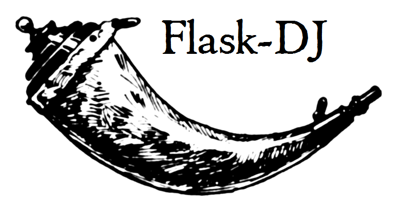

# Flask-DJ
 
 Since the flask has no strict architecture, <br>
it's easy to get confused when creating a project.<br>
This library was created to help everyone who wants to <br>
create a project with mvc structure.<br>
 
 ## Quick start
 ### Start project:
 
 ```shell script
$ flask-dj startproject app
```

or

 ```python
from flask_dj import startproject
from os import getcwd

your_project_name = 'app'
startproject(your_project_name, getcwd())
```
 ### New app:
 
   ```shell script
 python manage.py startapp {app_name}
```

### Start server:

```shell script
 python manage.py runserver
```
 
 ## Useful links:
 pypi: https://pypi.org/project/Flask-DJ/<br>
 full docs: https://flask-dj.readthedocs.io/en/latest/<br>
 habr: https://habr.com/ru/post/491852/<br>
